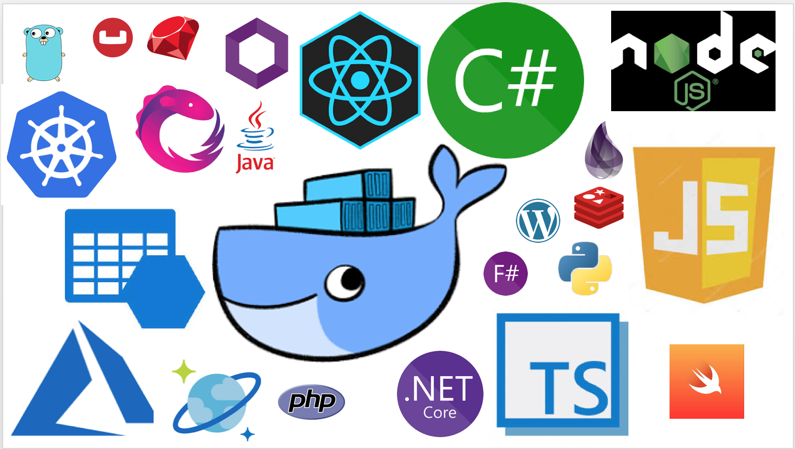

## Hello

* Working @ [Soluto](https://www.solutotlv.com/)
* Job title is a challenge 
* Doing all things related to DevOps/DevSecOps
* OWASP Glue project leader
* @omerlh / https://omerlh.info

---

# Why?
We already have pipline

---

---

---

## Containerized Applications Security Check List
- Static Analysis (Per language, some good open source solutions)
- Dynamic Analysis (OWASP Zaproxy)
- Dependencies Scan (Per language, OWASP Dependency Track has support for some languages)
- Container Image Scan (Clair, Anchore Engine, Hadolint)
- Deployment Files Scan 

---

# Let's Start!

A short disclaimer: 

Most of the tools I'll show are free and open source
Unfortunately, there are cases where there was only commercial tools available. 
Just to clarify, neither me or Soluto are not related to those tools and will not benefit from this tools.
